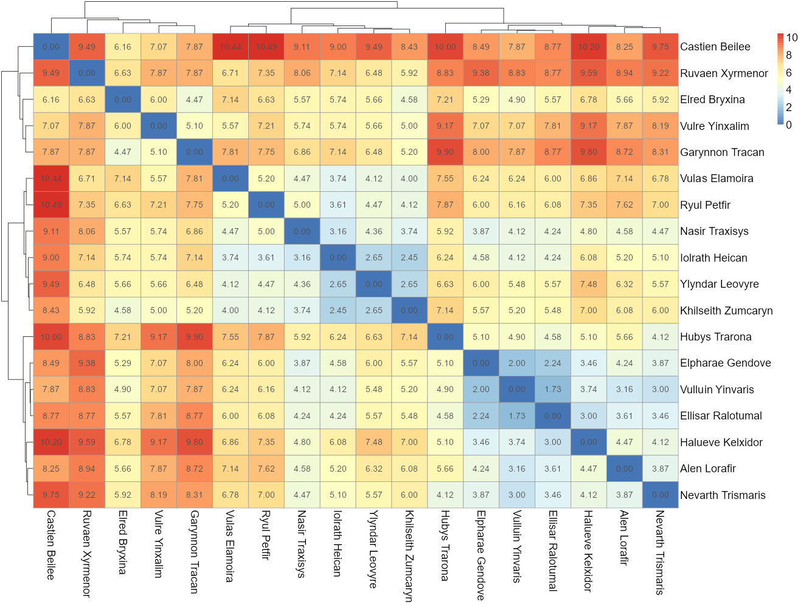

# Zářící PodobnostBio

Tento skriptík vznikl, jako malý sociální experiment na BioSeznamováku. Tento skript využívá Google Forms, pro zjednodušení práce. Na svůj google si zkopírujte tento [dotazík](https://drive.google.com/drive/folders/1kYbVO0qkEhbjKaVm0HKAjWdFvc6rOiRp?usp=sharing). **Zkopírovaný dotazník** rozešlete respondentům, případně připojte k jinému.

Dalším cílem ho bylo udělat co nejvíce foolproof, aby se mohl použít k rychlému icebreaku ve skupině. [Webová verze](https://dreryos.shinyapps.io/BioPodobnost/) pro nahrání dotazníku.

Pro skupiny tak do 20 lidí funguje bez problémů, ve větších skupinách je potřeba upravit velikosti grafů, ne vše je čitelné. U menších skupin může být problém s K klustrováním.

Pro větší hraní a nakouknutí pod kapotu tu je i samostatný R skript, může posloužit k vytvoření pdf apod.

## Příklad
